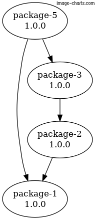

# Lerna Graph Action

This action generates a graph of all Lerna packages in their current version:



<br>

## Usage:

See parametes in [action.yml](./action.yml)

Persist the graph on Github artifacts to view them later

```
steps:
- uses: actions/checkout@v2

- run: mkdir -p graph

- name: Lerna Graph
- uses: lerdajs/lerna-graph-action
  with: 
    rootPath: .
    path: graph/image.png

- uses: actions/upload-artifact@v2
  with:
    name: lerna graph
    path: graph/image.png
```
